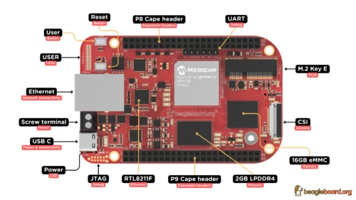

# **S1 DOCUMENTATION**

## 📡 **Linux Based IoT Gateway**

## 📟 **S1**

<video width="640" height="360" autoplay loop>
  <source src="images/s1.mp4" type="video/mp4">
  Your browser does not support the video tag.
</video>

## 🚀 **Overview**

The S1 is a next-generation Linux-based IoT Gateway that combines the strengths of the S0 IoT board and the BeagleV-Fire platform. Designed for smart metering and industrial IoT applications, the S1 gateway enables reliable and scalable data collection from Wireless M-Bus (wMBus).

At its core, the BeagleV-Fire runs a full Linux environment, providing high-level management, secure networking, and cloud connectivity. The S0 board, powered by the ESP32-C6 microcontroller, handles the low-level wireless communication and protocol translation for WM-Bus devices. Together, they form a hybrid system that bridges embedded real-time data acquisition with edge computing and Linux-based intelligence.

This design allows the S1 to seamlessly integrate with Magistrala, enabling large-scale deployment in smart metering, utility monitoring, and industrial telemetry systems.

## 🤝 **Contributing**

Please refer to the [CONTRIBUTING.md](https://github.com/absmach/.github/blob/main/CONTRIBUTING.md) file on how to contribute to this project.

## 📜 **License**

This project is licensed under the terms of the [Apache License](https://github.com/absmach/beagle-docs/blob/main/LICENSE).
